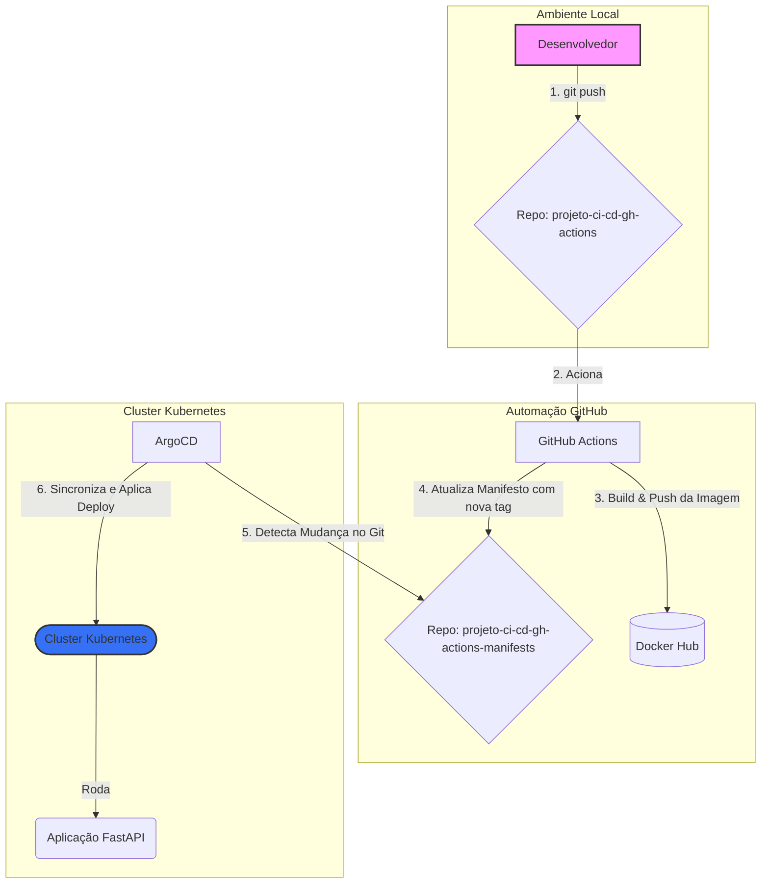

# **Projeto: CI/CD com GitHub Actions e ArgoCD**

[cite\_start]Este projeto implementa um pipeline completo e automatizado de CI/CD (Integração Contínua e Entrega Contínua) para uma aplicação web simples desenvolvida em FastAPI. [cite: 7, 15] [cite\_start]O objetivo é automatizar todo o ciclo de vida da aplicação, desde o commit do código até a implantação em um ambiente Kubernetes, utilizando práticas modernas de GitOps. [cite: 12, 15]

## **Arquitetura do Pipeline**

[cite\_start]O fluxo de trabalho garante que o repositório Git seja a única "fonte da verdade"[cite: 12], tanto para o código da aplicação quanto para a configuração da infraestrutura.



### **Tecnologias Utilizadas**

  * **Aplicação:** FastAPI
  * **Containerização:** Docker
  * [cite\_start]**CI/CD:** GitHub Actions [cite: 6, 9]
  * [cite\_start]**Registro de Imagem:** Docker Hub [cite: 15]
  * [cite\_start]**Orquestração:** Kubernetes [cite: 12]
  * [cite\_start]**Ambiente K8s Local:** Kind / Rancher Desktop [cite: 26]
  * [cite\_start]**GitOps Controller:** ArgoCD [cite: 9, 12]

## **Estrutura de Repositórios**

A abordagem utiliza dois repositórios Git para separar as responsabilidades:

1.  **`projeto-ci-cd-gh-actions`**:

      * [cite\_start]Contém o código-fonte da aplicação FastAPI (`main.py`). [cite: 34]
      * [cite\_start]Inclui o `Dockerfile` para construir a imagem da aplicação. [cite: 35]
      * [cite\_start]Armazena o workflow do GitHub Actions (`.github/workflows/ci.yaml`). [cite: 46]

2.  **`projeto-ci-cd-gh-actions-manifests`**:

      * [cite\_start]Armazena os manifestos de configuração do Kubernetes (`deployment.yaml`, `service.yaml`). [cite: 36, 61]
      * [cite\_start]Funciona como a "fonte da verdade" que o ArgoCD monitora para realizar os deploys. [cite: 62]

## **Arquivos do Projeto**

Abaixo estão os conteúdos de todos os arquivos necessários para a execução do projeto.

\<details\>
\<summary\>\<strong\>main.py (Aplicação FastAPI)\</strong\>\</summary\>

```python
[cite_start]from fastapi import FastAPI # [cite: 38]

[cite_start]app = FastAPI() # [cite: 39]


[cite_start]@app.get("/") # [cite: 40]
[cite_start]async def root(): # [cite: 41]
    [cite_start]return {"message": "Hello World"} # [cite: 42]
```

\</details\>

\<details\>
\<summary\>\<strong\>Dockerfile\</strong\>\</summary\>

```dockerfile
# Usar uma imagem base oficial do Python
FROM python:3.9-slim

# Definir o diretório de trabalho dentro do container
WORKDIR /app

# Copiar os arquivos da aplicação para o diretório de trabalho
COPY ./main.py /app/

# Instalar as dependências necessárias
RUN pip install fastapi uvicorn

# Expor a porta que a aplicação vai rodar
EXPOSE 8000

# Comando para iniciar a aplicação quando o container for executado
CMD ["uvicorn", "main:app", "--host", "0.0.0.0", "--port", "8000"]
```

\</details\>

\<details\>
\<summary\>\<strong\>.github/workflows/ci.yaml (GitHub Actions)\</strong\>\</summary\>

```yaml
name: CI-CD Pipeline

# Aciona o workflow em cada push para a branch main
on:
  push:
    branches: [ main ]

jobs:
  build-and-push:
    runs-on: ubuntu-latest
    steps:
      # 1. Faz o checkout do código da aplicação
      - name: Checkout da Aplicação
        uses: actions/checkout@v3

      # 2. Faz o login no Docker Hub usando os secrets
      - name: Login no Docker Hub
        uses: docker/login-action@v2
        with:
          username: ${{ secrets.DOCKER_USERNAME }}
          password: ${{ secrets.DOCKER_PASSWORD }}

      # 3. Builda a imagem Docker e envia para o Docker Hub
      - name: Build e Push da Imagem Docker
        uses: docker/build-push-action@v4
        with:
          context: .
          push: true
          # A tag da imagem será o hash do commit, garantindo uma versão única
          tags: SEU_USUARIO_DOCKERHUB/projeto-ci-cd-gh-actions:${{ github.sha }}

  update-manifest:
    # Garante que este job só rode após o sucesso do 'build-and-push'
    needs: build-and-push
    runs-on: ubuntu-latest
    steps:
      # 1. Faz o checkout do repositório de manifestos
      - name: Checkout do Repositório de Manifestos
        uses: actions/checkout@v3
        with:
          repository: SEU_USUARIO_GITHUB/projeto-ci-cd-gh-actions-manifests
          # Usa a chave SSH configurada nos secrets para ter permissão de escrita
          ssh-key: ${{ secrets.SSH_PRIVATE_KEY }}

      # 2. Atualiza a tag da imagem no arquivo deployment.yaml
      - name: Atualizar a tag da imagem no Deployment
        run: |
          sed -i 's|image: .*|image: SEU_USUARIO_DOCKERHUB/projeto-ci-cd-gh-actions:${{ github.sha }}|g' deployment.yaml

      # 3. Faz o commit e push da alteração no repositório de manifestos
      - name: Commit e Push da alteração
        run: |
          git config --global user.name 'GitHub Actions'
          git config --global user.email 'actions@github.com'
          git add deployment.yaml
          git commit -m "Atualizando imagem para a versão ${{ github.sha }}"
          git push
```

\</details\>

\<details\>
\<summary\>\<strong\>deployment.yaml\</strong\>\</summary\>

```yaml
apiVersion: apps/v1
kind: Deployment
metadata:
  name: hello-app
spec:
  replicas: 1
  selector:
    matchLabels:
      app: hello-app
  template:
    metadata:
      labels:
        app: hello-app
    spec:
      containers:
      - name: hello-app
        # IMPORTANTE: Substitua pelo seu usuário e nome da imagem.
        # A tag será atualizada automaticamente pelo pipeline.
        image: SEU_USUARIO_DOCKERHUB/projeto-ci-cd-gh-actions:latest
        ports:
        - containerPort: 8000
```

\</details\>

\<details\>
\<summary\>\<strong\>service.yaml\</strong\>\</summary\>

```yaml
apiVersion: v1
kind: Service
metadata:
  name: hello-app-service
spec:
  selector:
    app: hello-app
  ports:
    - protocol: TCP
      # Porta que o serviço expõe no cluster
      port: 8080
      # Porta que a aplicação está ouvindo dentro do container
      targetPort: 8000
```

\</details\>

## **Guia de Execução e Verificação**

Siga os passos abaixo para configurar e testar o projeto.

### **1. Configuração de Segredos e Chaves**

  * [cite\_start]No repositório `projeto-ci-cd-gh-actions`, vá em `Settings > Secrets and variables > Actions` e configure os seguintes segredos[cite: 50]:
      * [cite\_start]`DOCKER_USERNAME`: Seu usuário do Docker Hub. [cite: 52]
      * [cite\_start]`DOCKER_PASSWORD`: Seu token de acesso do Docker Hub. [cite: 51]
      * [cite\_start]`SSH_PRIVATE_KEY`: Chave SSH privada para dar acesso de escrita ao repositório de manifestos. [cite: 51]
  * No repositório `projeto-ci-cd-gh-actions-manifests`, vá em `Settings > Deploy keys` e adicione a chave SSH **pública** correspondente, marcando a opção "Allow write access".

### **2. Execução do Pipeline de CI**

  * Faça `git push` de todos os arquivos para o repositório `projeto-ci-cd-gh-actions`.
  * Acesse a aba "Actions" no GitHub para verificar a execução do workflow.
  * [cite\_start]Após o sucesso, verifique se a nova imagem foi publicada no seu Docker Hub. [cite: 72]
  * [cite\_start]Verifique também se um novo commit foi feito pelo "GitHub Actions" no repositório `projeto-ci-cd-gh-actions-manifests`, atualizando a tag da imagem. [cite: 73]

### **3. Deploy com ArgoCD**

  * Acesse a interface do ArgoCD. O comando `kubectl port-forward svc/argocd-server -n argocd 8080:443` pode ser usado para isso.
  * [cite\_start]Crie uma nova aplicação no ArgoCD, apontando para o repositório de manifestos. [cite: 64]
  * Aguarde a aplicação ser sincronizada e ficar com o status "Healthy".

### **4. Teste e Verificação Final**

  * [cite\_start]Verifique se o pod da aplicação está rodando no Kubernetes: `kubectl get pods`. [cite: 76]
  * [cite\_start]Use o port-forward para acessar a aplicação localmente: `kubectl port-forward svc/hello-app-service 8080:8080`. [cite: 66]
  * [cite\_start]Acesse `http://localhost:8080` no navegador ou via `curl` para ver a mensagem da API. [cite: 76]

## **Entregas Esperadas**

[cite\_start]Checklist final com as evidências de conclusão do projeto[cite: 68]:

  * [cite\_start][ ] **Link do repositório da aplicação:** `COLE SEU LINK AQUI` [cite: 70]
  * [cite\_start][ ] **Link do repositório de manifestos:** `COLE SEU LINK AQUI` [cite: 71]
  * [cite\_start][ ] **Print - Imagem no Docker Hub:** Captura de tela do Docker Hub mostrando a imagem publicada pelo pipeline. [cite: 72]
  * [cite\_start][ ] **Print - Commit Automático:** Captura de tela do histórico de commits do repositório de manifestos, mostrando a atualização feita pela Action. [cite: 73]
  * [cite\_start][ ] **Print - ArgoCD Sincronizado:** Captura de tela do painel do ArgoCD mostrando a aplicação com status "Healthy" e "Synced". [cite: 75]
  * [cite\_start][ ] **Print - Pods em Execução:** Captura de tela do terminal com o resultado do comando `kubectl get pods`. [cite: 76]
  * [cite\_start][ ] **Print - Resposta da Aplicação:** Captura de tela do navegador ou do `curl` mostrando a resposta da API. [cite: 76]