# **Projeto de Estágio: Pipeline CI/CD com GitOps e ArgoCD**

**Autor:** Giovanna Freitas | **Programa:** Programa de Bolsas - DevSecOps da Compass UOL

## **Resumo Executivo**

Este documento serve como um relatório técnico e um guia de implementação para um pipeline de automação CI/CD. Utilizando GitHub Actions, Docker, Kubernetes e ArgoCD, foi construído um fluxo de trabalho baseado nos princípios de **GitOps**, onde o repositório Git atua como a única fonte da verdade para o estado desejado da aplicação. O objetivo principal foi automatizar o ciclo completo de desenvolvimento, build, deploy e execução de uma aplicação FastAPI, garantindo velocidade, segurança e consistência nas entregas.

## **1. Visão Geral e Arquitetura**

A arquitetura implementada visa a automação total do processo de deploy. Qualquer alteração de código enviada ao repositório da aplicação dispara um processo que resulta na atualização automática do ambiente Kubernetes, sem necessidade de intervenção manual.

Este modelo é fundamentado na filosofia **GitOps**, onde o estado do sistema é descrito de forma declarativa em um repositório Git. Os principais benefícios são:

  * **Auditabilidade:** Todo o histórico de mudanças na infraestrutura fica registrado no Git.
  * **Consistência e Reprodutibilidade:** O ambiente pode ser recriado de forma confiável a partir do repositório.
  * **Segurança Aprimorada:** As alterações são revisadas e aprovadas via Pull Requests.

#### **Diagrama do Fluxo de Trabalho**

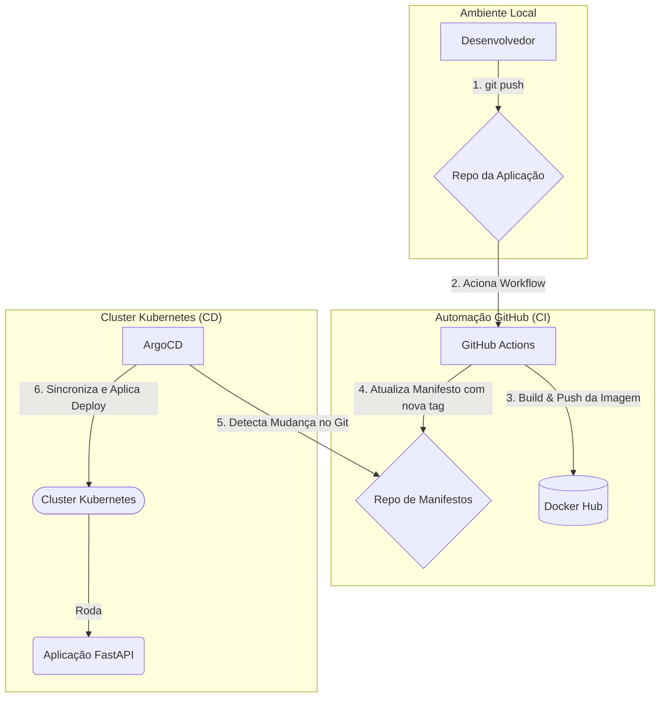

## **2. Tecnologias Aplicadas**

| Ferramenta | Papel no Projeto |
| :--- | :--- |
| **FastAPI** | Framework Python para a construção da aplicação web. |
| **Docker** | Plataforma de containerização para empacotar a aplicação e suas dependências. |
| **GitHub Actions** | [cite\_start]Orquestrador de CI para automatizar os processos de build, teste e publicação da imagem. [cite: 10] |
| **Docker Hub** | Registro de contêiner para armazenar as imagens Docker versionadas. |
| **Kubernetes (Kind)** | Plataforma de orquestração para executar a aplicação em contêineres de forma escalável. |
| **ArgoCD** | [cite\_start]Ferramenta de GitOps que implementa a entrega contínua, sincronizando o estado do cluster com o repositório de manifestos. [cite: 12] |

-----

## **Guia de Implementação (Passo a Passo)**

Esta seção detalha todas as etapas para recriar este projeto do zero.

### **Fase 1: Preparação do Ambiente e Repositórios**

#### **1.1. Pré-requisitos**

Garanta que você tenha todas as ferramentas e contas necessárias:

  * Conta no GitHub com um [token de acesso pessoal](https://docs.github.com/en/authentication/keeping-your-account-and-data-secure/managing-your-personal-access-tokens) com escopo `repo` e `workflow`.
  * Conta no Docker Hub com um token de acesso gerado.
  * Ferramentas de linha de comando: `git`, `docker`, `python3`, `kubectl`, `kind`.

#### **1.2. Criação dos Repositórios**

O modelo GitOps exige dois repositórios:

1.  **Repositório da Aplicação:** Crie um repositório público no GitHub chamado `projeto-ci-cd-gh-actions`.
2.  **Repositório de Manifestos:** Crie um segundo repositório público chamado `projeto-ci-cd-gh-actions-manifests`.
[Acesse o repositório de manifestos](https://github.com/oig04/projeto-ci-cd-gh-actions-manifests)
3.  Clone ambos os repositórios para a sua máquina local.

### **Fase 2: Criação dos Artefatos do Projeto**

Nesta fase, criamos todos os arquivos necessários.

#### **2.1. Código da Aplicação**

Dentro da pasta `projeto-ci-cd-gh-actions`, crie o arquivo `main.py`:

```python
from fastapi import FastAPI

app = FastAPI()

@app.get("/")
async def root():
    return {"message": "Hello World"}
```

#### **2.2. Dockerfile**

Na mesma pasta, crie o arquivo `Dockerfile` para containerizar a aplicação:

```dockerfile
# Usar uma imagem base oficial do Python
FROM python:3.9-slim
# Definir o diretório de trabalho
WORKDIR /app
# Copiar os arquivos da aplicação
COPY ./main.py /app/
# Instalar as dependências
RUN pip install fastapi uvicorn
# Expor a porta que a aplicação vai rodar
EXPOSE 8000
# Comando para iniciar a aplicação
CMD ["uvicorn", "main:app", "--host", "0.0.0.0", "--port", "8000"]
```

#### **2.3. Manifestos Kubernetes**

Dentro da pasta `projeto-ci-cd-gh-actions-manifests`, crie dois arquivos:

  * `deployment.yaml`:

    ```yaml
    apiVersion: apps/v1
    kind: Deployment
    metadata:
      name: hello-app
    spec:
      replicas: 1
      selector:
        matchLabels:
          app: hello-app
      template:
        metadata:
          labels:
            app: hello-app
        spec:
          containers:
          - name: hello-app
            image: SEU_USUARIO_DOCKERHUB/projeto-ci-cd-gh-actions:latest
            ports:
            - containerPort: 8000
    ```

  * `service.yaml`:

    ```yaml
    apiVersion: v1
    kind: Service
    metadata:
      name: hello-app-service
    spec:
      selector:
        app: hello-app
      ports:
        - protocol: TCP
          port: 8080
          targetPort: 8000
    ```

  * Adicione e envie estes dois arquivos para o repositório de manifestos: `git add .`, `git commit -m "feat: manifestos iniciais"`, `git push`.

#### **2.4. Workflow de CI/CD (GitHub Actions)**

Dentro do repositório da aplicação (`projeto-ci-cd-gh-actions`), crie a estrutura de pastas `.github/workflows/` e, dentro dela, o arquivo `ci.yaml`:

```yaml
name: CI-CD Pipeline
on:
  push:
    branches: [ main ]
jobs:
  build-and-push:
    runs-on: ubuntu-latest
    steps:
      - name: Checkout da Aplicação
        uses: actions/checkout@v3
      - name: Login no Docker Hub
        uses: docker/login-action@v2
        with:
          username: ${{ secrets.DOCKER_USERNAME }}
          password: ${{ secrets.DOCKER_PASSWORD }}
      - name: Build e Push da Imagem Docker
        uses: docker/build-push-action@v4
        with:
          context: .
          push: true
          tags: SEU_USUARIO_DOCKERHUB/projeto-ci-cd-gh-actions:${{ github.sha }}
  update-manifest:
    needs: build-and-push
    runs-on: ubuntu-latest
    steps:
      - name: Checkout do Repositório de Manifestos
        uses: actions/checkout@v3
        with:
          repository: SEU_USUARIO_GITHUB/projeto-ci-cd-gh-actions-manifests
          ssh-key: ${{ secrets.SSH_PRIVATE_KEY }}
      - name: Atualizar a tag da imagem no Deployment
        run: |
          sed -i 's|image: .*|image: SEU_USUARIO_DOCKERHUB/projeto-ci-cd-gh-actions:${{ github.sha }}|g' deployment.yaml
      - name: Commit e Push da alteração
        run: |
          git config --global user.name 'GitHub Actions'
          git config --global user.email 'actions@github.com'
          git add deployment.yaml
          git commit -m "Atualizando imagem para a versão ${{ github.sha }}"
          git push
```

### **Fase 3: Configuração da Automação e Deploy**

#### **3.1. Configuração de Segredos e Chaves**

1.  **Chave SSH:** Gere um par de chaves com `ssh-keygen -t rsa -b 4096 -f github-actions-key`.
2.  **Deploy Key:** No repositório de **manifestos**, vá em `Settings > Deploy keys`, clique em `Add deploy key`, cole o conteúdo da chave **pública** (`github-actions-key.pub`) e marque a opção "Allow write access".
3.  **Secrets:** No repositório da **aplicação**, vá em `Settings > Secrets and variables > Actions` e crie os três segredos necessários: `DOCKER_USERNAME`, `DOCKER_PASSWORD` e `SSH_PRIVATE_KEY` (com o conteúdo da chave privada).

#### **3.2. Primeiro Push e Verificação do CI**

1.  No repositório da aplicação, adicione e envie todos os arquivos: `git add .`, `git commit -m "feat: adiciona aplicacao e pipeline de CI"`, `git push`.
2.  Acesse a aba "Actions" no GitHub para verificar a execução bem-sucedida do workflow.

> **Ponto de Verificação e Evidência:**

> 1.  *O sucesso do workflow na aba "Actions" do GitHub.*
> 2.  *A nova imagem publicada no seu repositório do Docker Hub.*
> 3.  *O commit automático feito pela Action no histórico do repositório de manifestos.*
<p align="center">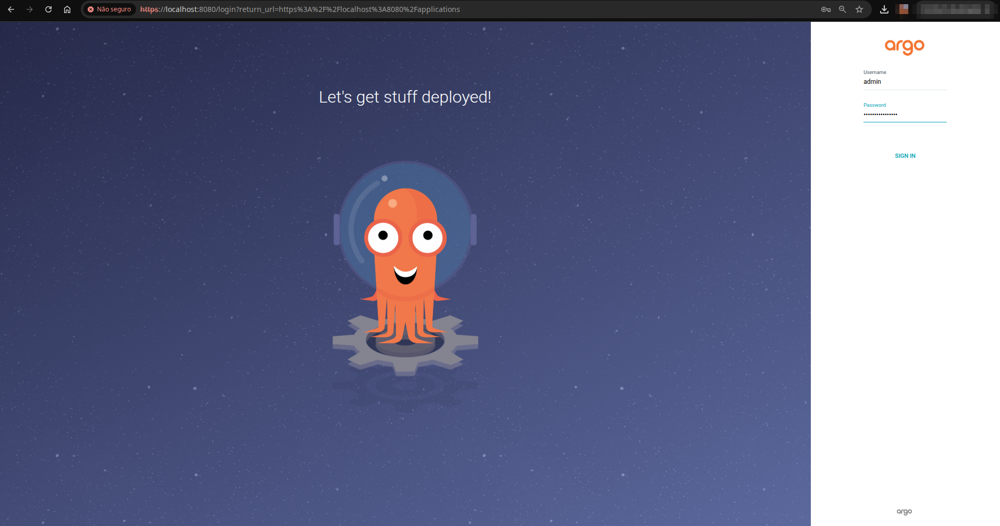</p>
<p align="center"></p>
<p align="center">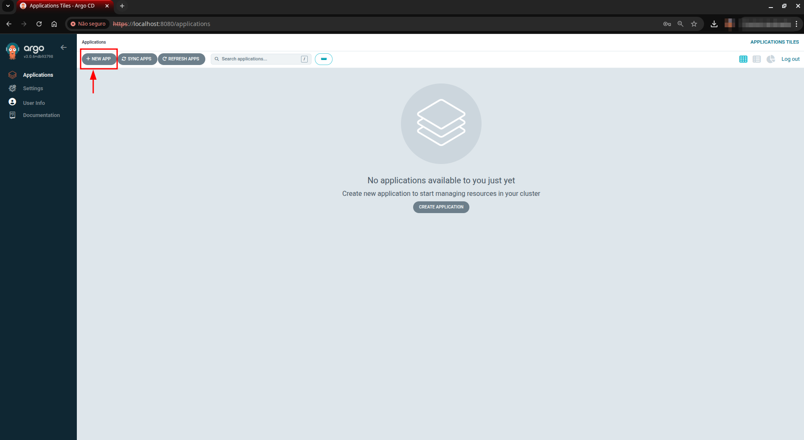</p>
<p align="center">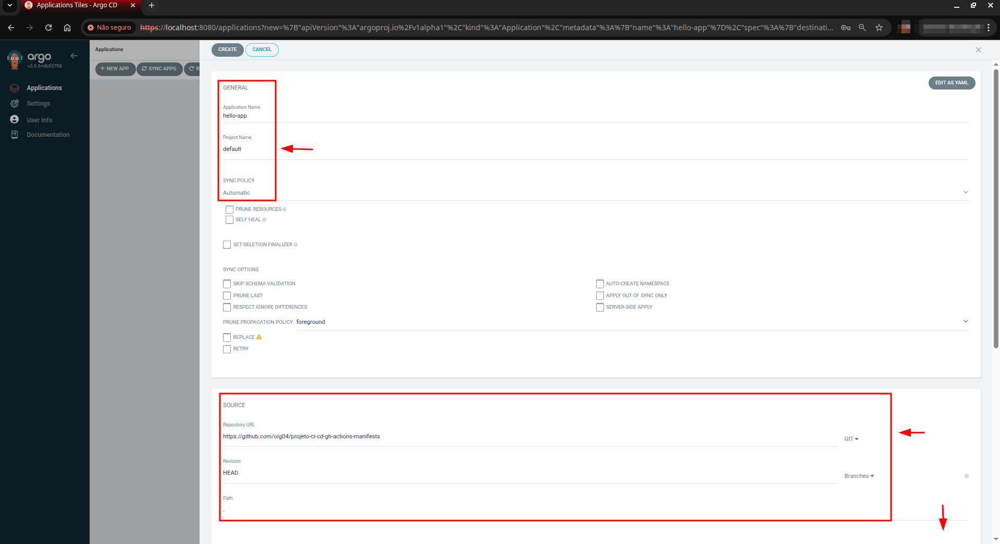</p>

#### **3.3. Preparação do Ambiente Kubernetes**

1.  Crie um cluster local com `kind create cluster`.
2.  Instale o ArgoCD no cluster:
    ```bash
    kubectl create namespace argocd
    kubectl apply -n argocd -f https://raw.githubusercontent.com/argoproj/argo-cd/stable/manifests/install.yaml
    ```
3.  Monitore a instalação com `kubectl get pods -n argocd --watch` até que todos os pods estejam `Running`.

#### **3.4. Configuração e Deploy com ArgoCD**

1.  Acesse a interface do ArgoCD com `kubectl port-forward svc/argocd-server -n argocd 8080:443`.
2.  Obtenha a senha com `kubectl -n argocd get secret argocd-initial-admin-secret -o jsonpath="{.data.password}" | base64 -d`.
3.  Faça login em `https://localhost:8080` com o usuário `admin` e a senha obtida.
4.  Crie uma nova aplicação no ArgoCD, apontando para o seu repositório de manifestos.

> **Ponto de Verificação e Evidência:**

> 1.  *O painel do ArgoCD mostrando a aplicação `hello-app` com status `Healthy` e `Synced`.*
<p align="center">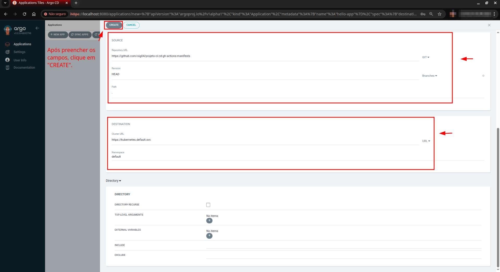</p>

> 2.  *A visão em árvore detalhada dos recursos gerenciados pelo ArgoCD.*
<p align="center">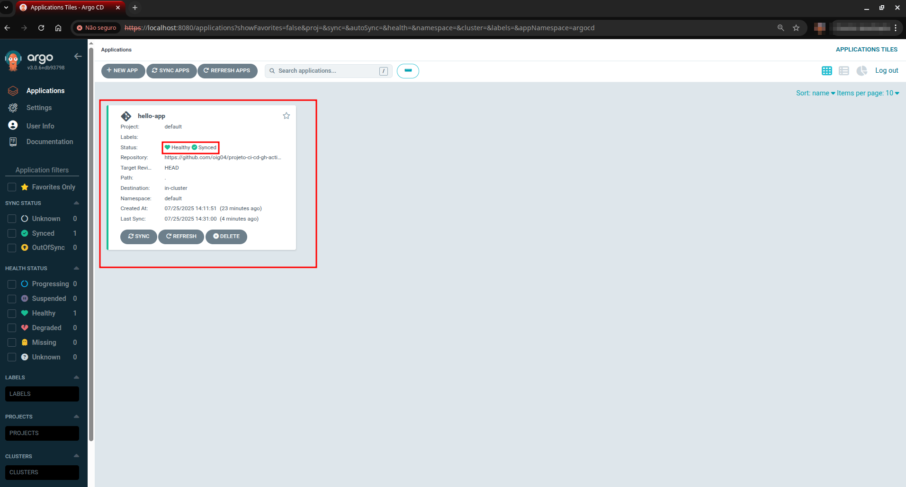</p>

#### **3.5. Validação Final no Cluster**

1.  Verifique os recursos criados com `kubectl get all -l app=hello-app`.
2.  Acesse a aplicação com `kubectl port-forward svc/hello-app-service 8080:8080`.
3.  Teste a aplicação com `curl http://localhost:8080`.

> **Ponto de Verificação e Evidência:**

> 1.  *O resultado do comando `kubectl get all` mostrando o pod em execução.*
<p align="center">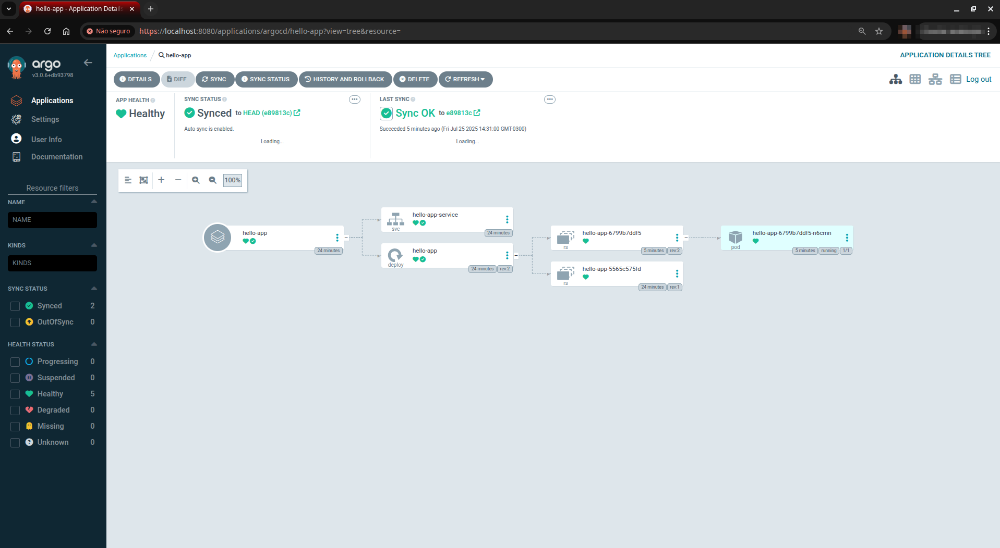</p>
> 2.  *O resultado do comando `curl` mostrando a resposta `{"message":"Hello World"}`.*
<p align="center">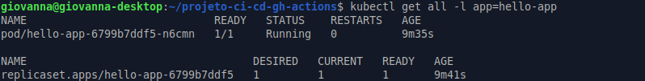</p>

## **5. Considerações de Segurança (DevSecOps)**

  * **Gerenciamento de Segredos:** Credenciais sensíveis são gerenciadas via **GitHub Encrypted Secrets**, evitando sua exposição em código.
  * **Imutabilidade de Imagens:** O uso de tags de imagem baseadas no hash do commit (`github.sha`) garante que cada versão da imagem seja única e imutável, fundamental para rastreabilidade e análise de vulnerabilidades.
  * **Auditabilidade e Controle de Acesso:** O modelo GitOps fornece um log de auditoria completo (histórico do Git) para todas as mudanças no ambiente.

## **6. Conclusão**

Este projeto demonstrou com sucesso a criação de um pipeline CI/CD robusto e seguro. As práticas de GitOps, combinadas com GitHub Actions e ArgoCD, permitem um fluxo de desenvolvimento ágil e confiável, essencial no ecossistema DevOps moderno.

> **Ponto de Verificação e Evidência:**
<p align="center">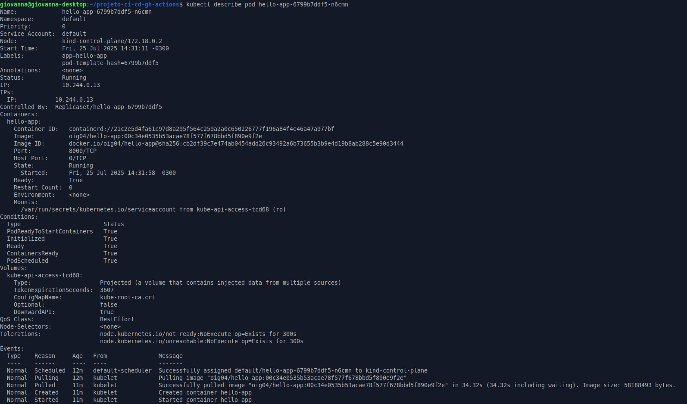</p>
<p align="center">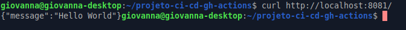</p>
<p align="center">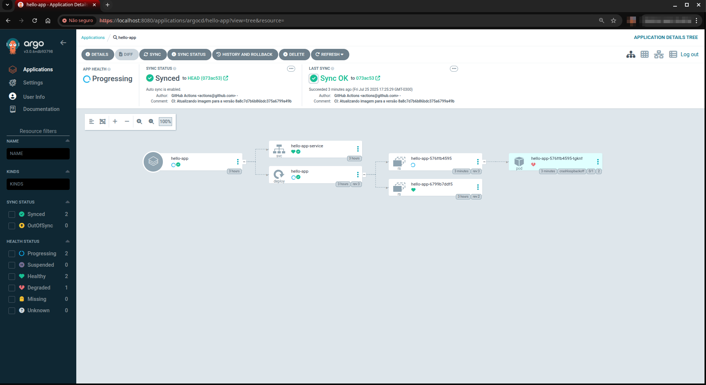</p>
<p align="center">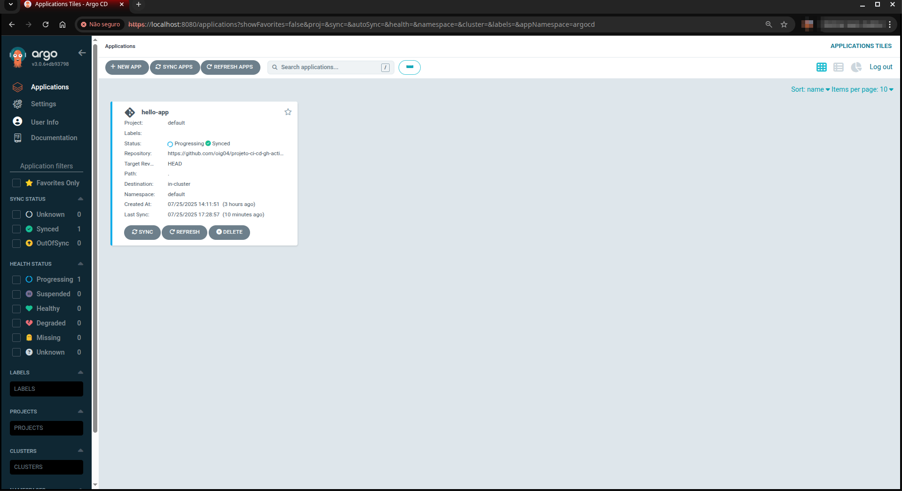</p>
<p align="center">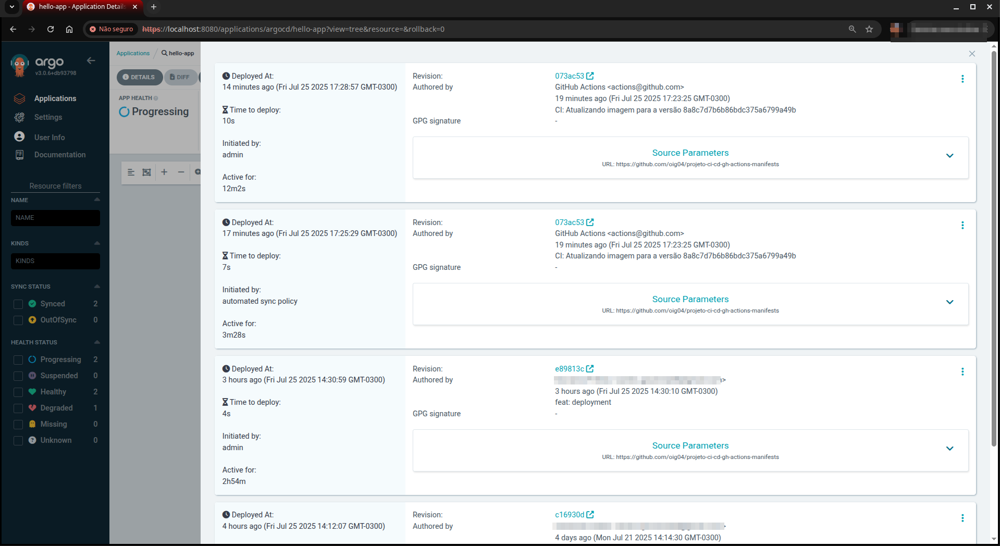</p>
<p align="center">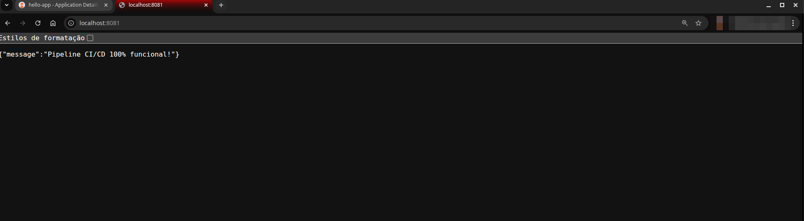</p>